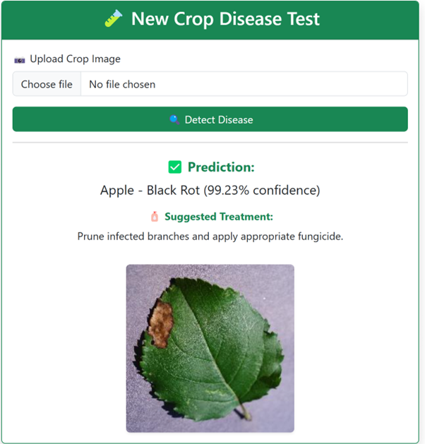

# 🌿 AI-Based Crop Disease Detection Web App

This project is a lightweight, AI-driven web application that helps farmers detect crop diseases by simply uploading a leaf image. The system uses **YOLOv8 for leaf verification** and **MobileNetV2 (Transfer Learning)** for accurate disease classification.

---

## 🔍 Key Features

- ✅ **Leaf Image Verification** with YOLOv8 to ensure valid crop leaf input
- 🌱 **Disease Prediction** using MobileNetV2 trained on 38-class PlantVillage dataset
- 💊 **Treatment Suggestions** based on detected disease
- 📷 **User-friendly Web Interface** with image upload, prediction results, and confidence score
- 🗂️ **Lightweight Deployment** using Flask and SQLite
- 📊 **Evaluation** with >94% test accuracy and real-user testing

---

## 🧠 Model Info

- Model: **MobileNetV2**
- Dataset: [PlantVillage Dataset](https://www.kaggle.com/emmarex/plantdisease)
- Accuracy: **94%+**
- YOLOv8s used for **image validation**

---

## 🧪 Technologies Used

- Python, TensorFlow, Keras, OpenCV, Ultralytics YOLOv8
- Flask (Backend) + HTML/CSS/Bootstrap (Frontend)
- SQLite (Local Database)
- Google Colab (Model Training)

---

## 📸 Demo Screenshot

---

## 📌 Future Improvements

- 📱 Mobile App version
- 🌐 Multilingual interface
- 🌍 GPS-based disease mapping
- ☁️ Cloud deployment

---

## 👤 Author

**Muhammad Saqib**  
Final Year MSc IT Student, TH OWL, Germany  
Email: muhammad.saqib@stud.th-owl.de

---

⭐ Feel free to star this project if you find it useful!
